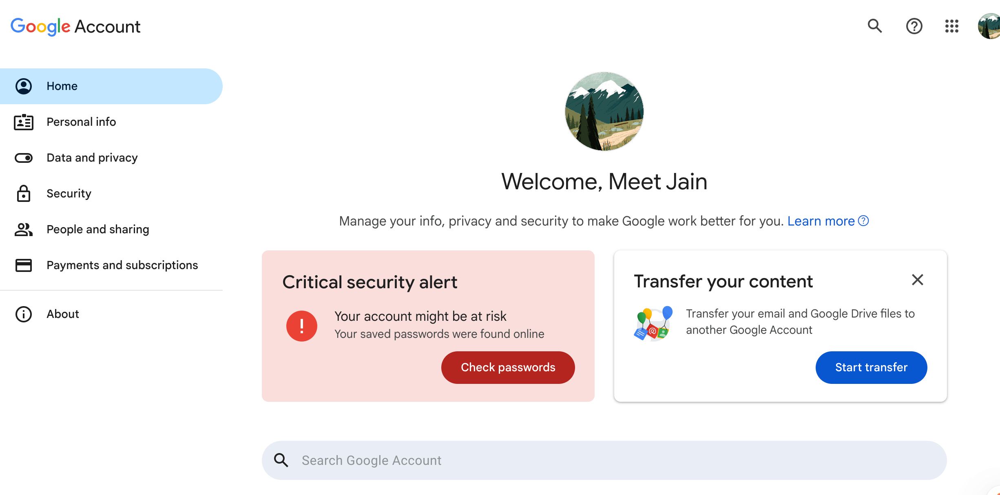
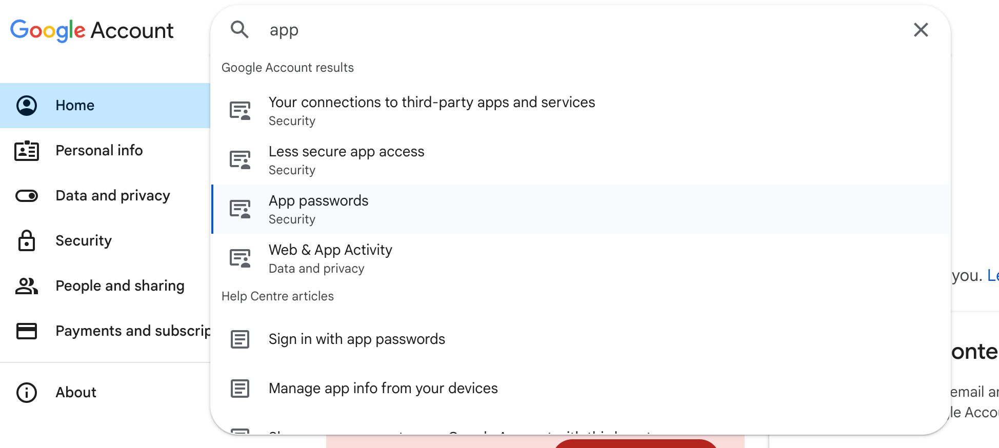
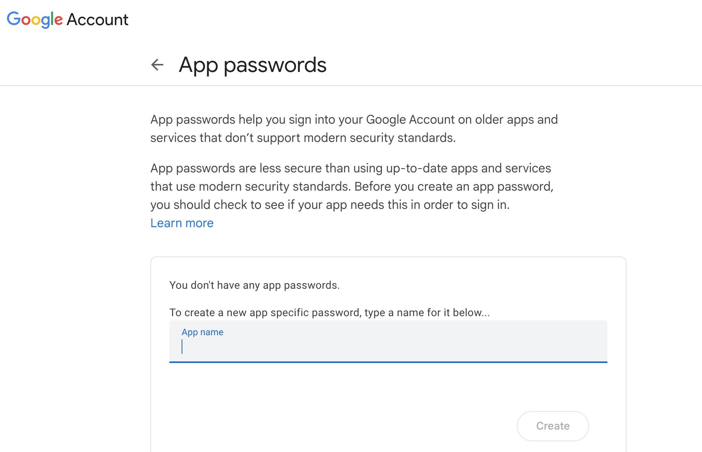
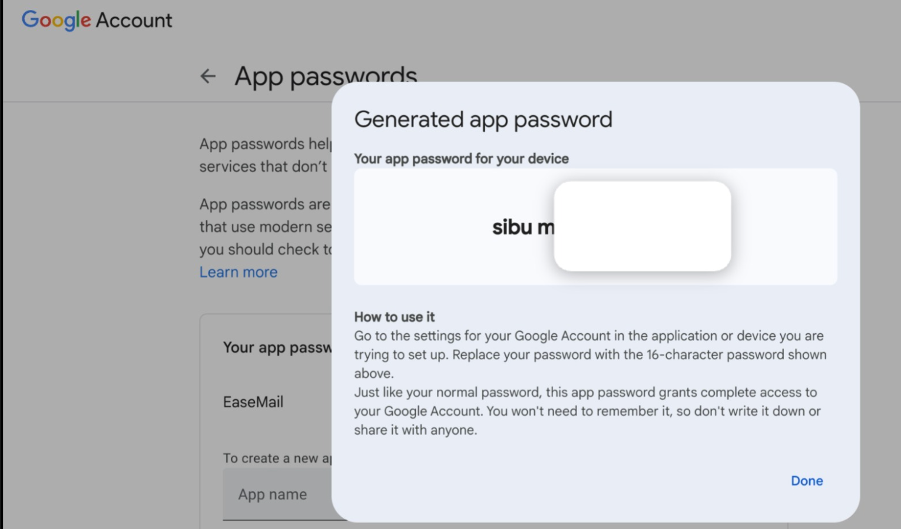

# 📧 EasyMail – Email-Sending Next.js App

EasyMail is a lightweight Next.js application that enables users to send emails using Gmail via SMTP. This project is designed to be deployed on [Vercel](https://vercel.com) and uses serverless functions to handle secure email delivery with `nodemailer`.

---

## 🚀 Deployment Instructions

### ✅ 1. Clone the Repository

```bash
git clone https://github.com/<your-username>/easymail.git
cd easymail
````

---

### 🔐 2. Set Up Environment Variables

Create a `.env.local` file in the root of your project with the following keys:

```env
NEXTAUTH_URL=http://localhost:3000
NEXTAUTH_SECRET=your_random_secret

DATABASE_URL=your_neon_database_url

EMAIL_SERVER_HOST=smtp.gmail.com
EMAIL_SERVER_PORT=587
EMAIL_SERVER_USER=your-email@gmail.com
EMAIL_SERVER_PASSWORD=your_app_password
EMAIL_FROM=your-email@gmail.com

GOOGLE_API_KEY_ANALYZER=your_google_api_key
```

> ⚠️ Never commit `.env.local` to GitHub.

---

### 📧 3. How to Generate a Gmail App Password

Follow these steps to generate an App Password for your Gmail account:

1. **Go to your Google Account**:
   [https://myaccount.google.com/](https://myaccount.google.com/)

2. **Navigate to "Security" tab** (📸 *See Screenshot 1*)

3. **Enable 2-Step Verification** if not already enabled (📸 *See Screenshot 2*)

4. After 2FA is enabled, go to **"App Passwords"** section
   (📸 *See Screenshot 3*)

5. Select:

   * **App** → "Mail"
   * **Device** → "Other" (name it e.g. "EasyMail App")






6. Google will generate a 16-character password. **Copy this** and use it in the `.env.local` file as `EMAIL_SERVER_PASSWORD`.

> 💡 You **must use this App Password**, not your Gmail account password.
you can use that app password with out the space baar directly in the application

---

### 🌐 4. Deploy to Vercel

1. Push the code to GitHub.
2. Go to [vercel.com](https://vercel.com) and import your repository.
3. In your Vercel project dashboard, set the environment variables (same as in `.env.local`).
4. Click **Deploy**.

---

## 🧪 Test Locally

```bash
npm install
npm run dev
```

Visit [http://localhost:3000](http://localhost:3000) to test email sending.

---

## 📂 Project Structure

```
/pages
  └── /api
       └── sendEmail.ts   # Email API using nodemailer
.env.local                 # Environment configuration
```

---

## 🛡️ Security Notes

* Gmail App Passwords are required because Google blocks less secure apps by default.
* Vercel allows secure outbound SMTP connections on port `587`, no manual port config needed.

---

## 📞 Contact

For help or contributions, email us at:
📨 **[contact.hackathonmj@gmail.com](mailto:contact.hackathonmj@gmail.com)**


